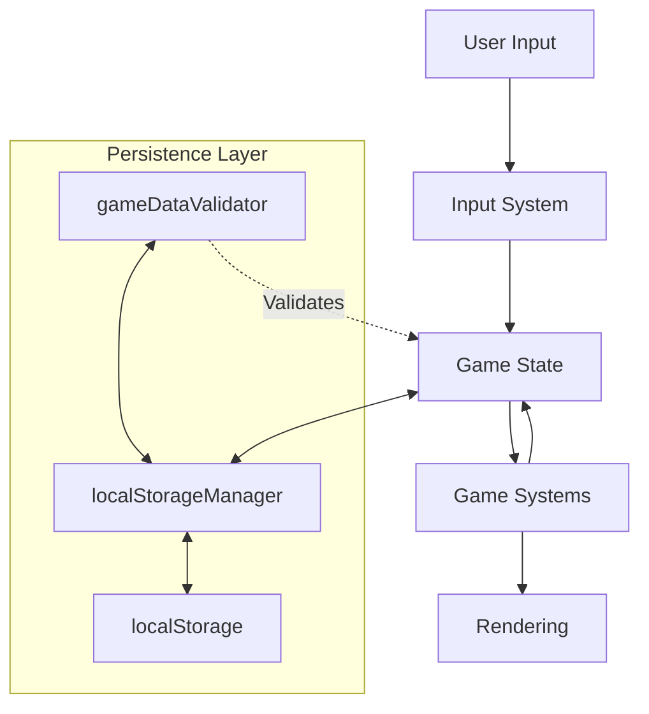

# Carole's Reef - Architecture

## Status

- Mixed: GameState/persistence details reflect current intent, while input/rendering still rely on legacy runtime
- Use `docs/ActiveFiles.txt` for the definitive list of active runtime files

## Overview

Carole's Reef is an aquarium simulation featuring procedurally generated fish with genetic traits. This document outlines the high-level architecture and design decisions.

## Core Concepts

### Data Flow



## State Management

### GameState (Single Source of Truth)

- **Location**: `/state/GameState.ts`
- **Purpose**: Centralized management of all game state
- **Key Responsibilities**:
  - Maintains in-memory game state
  - Manages subscriptions to state changes
  - Handles state updates in an immutable way
  - Coordinates with persistence layer
  - Planned: replace `fishCollection` with `bioInventory` to support multi-species ownership

### State Structure

```typescript
interface GameState {
  version: string;
  lastSaved: number;
  gameState: {
    gameTime: number;
    currentScene: string;
    score: number;
  };
  settings: {
    volume: number;
    sfxMuted: boolean;
    musicMuted: boolean;
    musicTrack: string;
    theme: string;
    uiScale: number;
  };
  tank: {
    background: string;
    decorations: any[];
  };
  progress: {
    unlocked: string[];
    flags: Record<string, boolean>;
  };
  fishCollection: FishCollectionItem[];
}
```

## Data Flow & Persistence

### Loading Data

1. `localStorageManager.load()` retrieves raw data from localStorage
2. `gameDataValidator` validates and transforms the raw data
3. Validated data is passed to `gameState.load()`
4. `gameState` updates internal state and notifies subscribers

### Saving Data

1. `gameState.save()` prepares data for persistence
2. Converts internal state to `GameSaveData` format
3. Calls `storageManager.save()` with the prepared data
4. `storageManager` handles the actual localStorage operations

## Validation Layer

### gameDataValidator

- **Location**: `/src/utils/gameDataValidator.ts`
- **Responsibilities**:
  - Validates all game data before it enters the state
  - Handles data migration between versions
  - Ensures data integrity and consistency
  - Provides default values for missing data

## Storage Layer

### localStorageManager

- **Location**: `/src/utils/localStorageManager.ts`
- **Key Features**:
  - Only module that directly interacts with `localStorage`
  - Handles serialization/deserialization
  - Manages storage keys and versioning
  - Implements backup/restore functionality

## Performance Considerations

- **State Updates**:
  - Batched updates to minimize re-renders
  - Selective subscription model for components
- **Memory Management**:
  - Efficient data structures for fish collection
  - Object pooling for frequently created/destroyed entities
- **Rendering**:
  - Canvas-based rendering for optimal performance
  - Spatial partitioning for collision detection
  - Efficient rendering with requestAnimationFrame

## Best Practices

1. **State Updates**:
   - Use `gameState.updateState()` for all state modifications
   - Keep state updates minimal and batched when possible

2. **Data Validation**:
   - All external data must be validated before entering the game state
   - Use `gameDataValidator` for all data validation needs

3. **Persistence**:
   - Only `localStorageManager` should interact with `localStorage`
   - Use the provided save/load methods in `GameState` for persistence
